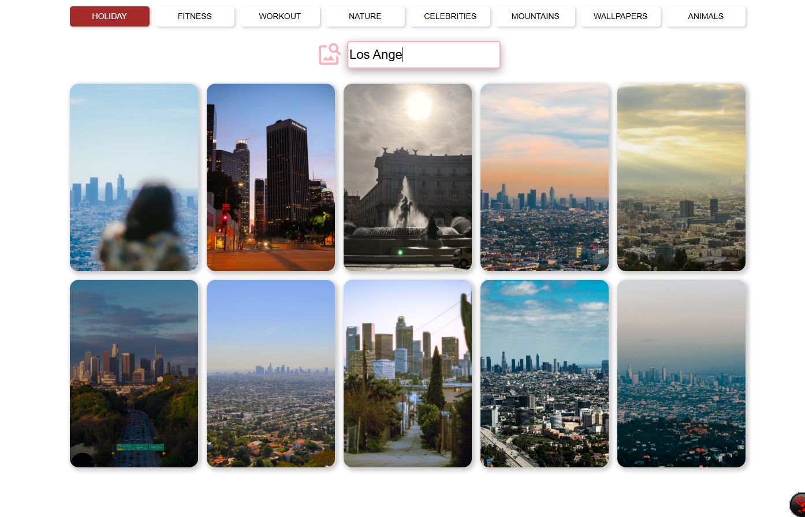

Photo Search App

A simple React app for browsing and searching high-quality photos, powered by the Pexels API. Users can either search for photos by keyword or quickly browse curated categories using tag buttons.

Preview

Features
🔍 Live photo search by keyword
🏷️ Predefined category tags (fitness, nature, animals, people, etc.) for one-click browsing
🖼️ Responsive photo grid/card layout
⚡ Built with React and the Pexels API
Tech Stack
React
Vite
Pexels API
react-icons
Project Structure
src/
├── components/
│   ├── SearchBar/       # Text input for search queries
│   ├── SearchContainer/ # Wrapper for the search bar + icon
│   ├── Card/             # Single photo card
│   ├── CardContainer/    # Fetches photos from Pexels and renders a grid of Cards
│   ├── Tag/              # Single category tag button
│   └── TagContainer/     # Row of category tags
├── App.jsx
├── App.css
└── main.jsx
Getting Started
Prerequisites
Node.js (v18+ recommended)
A free Pexels API key
Installation
bash
git clone <https://github.com/mrd-test/Search-APP>
cd </Search-APP>
npm install
Environment Variables

This project requires a Pexels API key. Create a .env file in the project root:

VITE_PEXELS_API_KEY=your_pexels_api_key_here

Running Locally
bash
npm run dev

The app will be available at http://localhost:5173 (default Vite port).

Build for Production
bash
npm run build
How It Works
TagContainer renders a set of predefined category tags; clicking one sets the active search query.
SearchBar allows the user to type a custom search query, which overrides the selected tag.
CardContainer fetches photos from the Pexels API based on the current query and renders them as a grid of Card components.
License

This project is for educational/personal use. Photo content is provided by Pexels and subject to their terms of use.